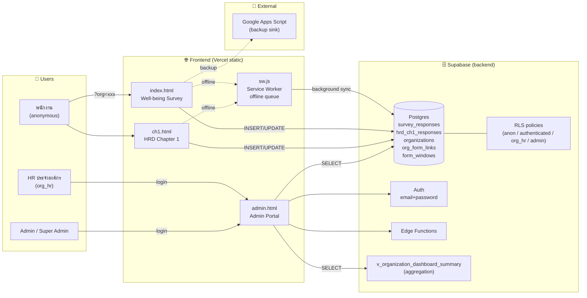

# Well-being Survey System

ระบบสำรวจสุขภาวะบุคลากรสำหรับหน่วยงานภาครัฐ ประกอบด้วยแบบสำรวจหลัก 2 ส่วน และพอร์ทัลผู้ดูแลระบบสำหรับจัดการข้อมูล วิเคราะห์ผล และดูแลสิทธิ์การเข้าถึง

## ภาพรวมระบบ

โปรเจกต์นี้เป็นระบบสำรวจครบชุดที่ครอบคลุมการประเมินสุขภาวะบุคลากร 4 มิติ (กาย ใจ สังคม แวดล้อม)

1. **แบบสำรวจสุขภาวะรายบุคคล** (Public Survey) - 97 คำถามครอบคลุม 4 มิติ
2. **แบบสำรวจ CH1** สำหรับ HR หรือผู้ดูแลขององค์กร
3. **Admin Portal** สำหรับจัดการองค์กร ผู้ใช้ สิทธิ์ และดูรายงาน
4. **E2E Automation** สำหรับทดสอบระบบอัตโนมัติ
5. **Backend** บน Supabase สำหรับฐานข้อมูล สิทธิ์ RLS การยืนยันตัวตน และ Edge Functions
6. **Deployment** บน Vercel สำหรับ production

### Architecture Diagram



> Data-flow ย่อ: form → RLS → Postgres → aggregation view → Admin Portal; ขณะ offline จะเข้าคิวใน Service Worker IndexedDB แล้ว sync อัตโนมัติตอนกลับมาออนไลน์

## แอปหลักในระบบ

| ส่วนระบบ | ไฟล์หลัก | เส้นทางใช้งาน | จุดประสงค์ |
|---|---|---|---|
| Public Well-being Survey | `apps/public-survey/index.html` | `/` | แบบสำรวจสุขภาวะ 4 มิติ (97 คำถาม) |
| CH1 Survey | `ch1.html` | `/ch1` | แบบฟอร์มสำรวจข้อมูล HRD บทที่ 1 |
| Admin Portal | `admin.html` | `/admin` | จัดการระบบ ดูข้อมูล และวิเคราะห์ผล |

## ฟีเจอร์หลัก

### 1. Public Well-being Survey

- **97 คำถาม** ครอบคลุม 4 มิติ (กาย ใจ สังคม แวดล้อม)
- รองรับลิงก์เฉพาะองค์กรผ่าน `?org=test-org`
- แบ่งเป็น 7 ส่วน: personal, consumption, nutrition, activity, mental, loneliness, safety, environment
- รองรับคำถามหลายประเภท: radio, text, number, checkbox, time, scale
- บันทึกแบบร่างอัตโนมัติ (localStorage + Supabase)
- กลับมากรอกต่อได้
- ตรวจสอบความถูกต้องของข้อมูลก่อนส่ง
- รองรับการสร้างไฟล์พิมพ์สำหรับดาวน์โหลด PDF
- มีโครงสร้างคำถามด้านสุขภาพจิต (TMHI-15) และ UCLA Loneliness Scale (20 ข้อ)

### 2. CH1 Survey

- แบบฟอร์มหลายขั้นตอน
- โครงสร้าง 5 ส่วนตามแบบฟอร์มล่าสุด
- ตรวจสอบผลรวมข้อมูลกำลังคนและข้อมูลเชิงโครงสร้าง
- จัดอันดับประเด็นสำคัญได้
- รองรับแนบไฟล์ PDF ที่เกี่ยวข้อง
- มีสถานะ lifecycle ของแบบฟอร์ม เช่น `draft`, `submitted`, `reopened`, `locked`
- รองรับการพิมพ์/ดาวน์โหลด PDF จากข้อมูลจริง

### 3. Admin Portal

- ล็อกอินด้วย Supabase Auth
- แสดงเมนูตามบทบาทผู้ใช้
- แดชบอร์ดสรุปผลและกราฟวิเคราะห์
- ดูคำตอบรายบุคคล
- ส่งออกข้อมูลเป็น CSV/Excel
- จัดการข้อมูลองค์กร
- จัดการสิทธิ์ผู้ใช้และบทบาท
- จำกัดสิทธิ์ตามองค์กรสำหรับ `org_hr`

### 4. E2E Automation

- **Playwright E2E Testing** สำหรับทดสอบระบบอัตโนมัติ
- **`survey-e2e-runner.js`** จำลองการกรอกแบบสำรวจจริง
- กรอกครบทุก 97 คำถามแบบ explicit
- ตรวจสอบการ submit และการบันทึกลงฐานข้อมูล
- รองรับการรันหลายรอบ และ headless/headed mode
- รายงานผลลัพธ์พร้อม coverage และ network verification

### 5. Backend และ Security

- ใช้ Supabase PostgreSQL เป็นฐานข้อมูลหลัก
- ใช้ Row Level Security (RLS) แยกสิทธิ์ตามบทบาท
- มี helper functions เช่น `requester_email()`, `requester_role()`, `requester_org()`, `requester_is_admin()`
- มีตาราง `admin_user_roles`, `organizations`, `survey_responses`, `hrd_ch1_responses`, `form_windows`, `form_question_overrides`
- มี Edge Functions สำหรับงาน integration บางส่วน

### 6. Integration และ Operations

- เชื่อม Google Sheets / Apps Script สำหรับงาน sync
- มีสคริปต์ช่วยตรวจ schema และ readiness
- มีสคริปต์ seed, clear test data, export และดูสถิติฐานข้อมูล
- มีการตั้งค่า route, headers และ cache ผ่าน `vercel.json`

## เทคโนโลยีที่ใช้

| ชั้นระบบ | เทคโนโลยี |
|---|---|
| Frontend | HTML5, CSS, Vanilla JavaScript |
| Backend | Supabase (PostgreSQL, Auth, Storage, Edge Functions) |
| Deployment | Vercel |
| Testing | Playwright (E2E Automation) |
| Integration | Google Sheets, Google Apps Script |
| Utility Scripts | Node.js |

## โครงสร้างโปรเจกต์โดยสรุป

```text
Well-being Survey/
├── apps/
│   └── public-survey/            # Public Well-being Survey
│       ├── index.html           # Main entry point
│       ├── css/                  # Stylesheets
│       └── js/                   # App logic, components, questions
├── index.html                    # Legacy entry (redirects to apps/)
├── ch1.html                      # CH1 Survey
├── admin.html                    # Admin Portal
├── admin-login.html              # Admin login page
├── wb-printable.html             # Well-being printable view
├── ch1-printable.html            # CH1 printable view
├── survey-e2e-runner.js          # E2E automation script
├── js/                          # Legacy/shared JavaScript
├── css/                         # Main stylesheets
├── assets/                      # Images, fonts, resources
├── scripts/                     # Utility scripts
├── backend/
│   └── supabase/                # Supabase configuration
│       ├── migrations/          # Database migrations
│       ├── functions/           # Edge functions
│       └── policies/             # Security policies
├── docs/                        # Documentation
└── vercel.json                  # Deployment configuration
```

## ตารางหลักในฐานข้อมูล

| ตาราง | หน้าที่ |
|---|---|
| `organizations` | ข้อมูลองค์กรหลัก |
| `admin_user_roles` | ผู้ใช้และบทบาทของระบบ |
| `survey_responses` | คำตอบแบบสำรวจสุขภาวะรายบุคคล |
| `hrd_ch1_responses` | คำตอบแบบสำรวจ CH1 |
| `org_form_links` | ลิงก์ฟอร์มเฉพาะองค์กร |
| `survey_forms` | รายการฟอร์มและสิทธิ์การแก้ไข |
| `form_windows` | ช่วงเวลาเปิด-ปิดแบบฟอร์ม |
| `form_question_overrides` | ข้อความคำถามที่แอดมินแก้ไขได้ |
| `admin_audit_logs` | ประวัติการกระทำในระบบหลังบ้าน |

## การติดตั้งสำหรับพัฒนาในเครื่อง

### 1. ติดตั้ง dependencies

```bash
npm install
```

### 2. เตรียม Environment Variables

สร้างไฟล์ `.env.local` แล้วกำหนดค่าอย่างน้อยดังนี้

```env
SUPABASE_URL=https://YOUR_PROJECT_REF.supabase.co
SUPABASE_ANON_KEY=YOUR_SUPABASE_ANON_KEY
SUPABASE_SERVICE_ROLE_KEY=YOUR_SUPABASE_SERVICE_ROLE_KEY
GOOGLE_SYNC_WEBHOOK_URL=YOUR_GOOGLE_APPS_SCRIPT_URL
GOOGLE_SYNC_SHARED_SECRET=YOUR_SHARED_SECRET
```

หมายเหตุ:

- ฝั่งหน้าเว็บใช้ค่า public/anon key
- ฝั่งสคริปต์ admin และงานหลังบ้านใช้ service role key

### 3. เปิดระบบในเครื่อง

ใช้ static server ตัวใดตัวหนึ่ง เช่น

```bash
npm run dev
```

หรือ

```bash
python -m http.server 8000
```

### 4. เตรียม Supabase CLI ถ้าต้อง deploy functions

```bash
npx supabase login
npx supabase link --project-ref YOUR_PROJECT_REF
npm run supabase:deploy
```

## คำสั่งที่ใช้บ่อย

```bash
# Development
npm run dev

# Testing & Automation
npm run test:public-survey          # Run E2E automation

# Deployment
npm run deploy                      # Deploy to production
npm run deploy:preview              # Deploy preview

# Database Operations
npm run supabase:test               # Test database connection
npm run supabase:stats              # Database statistics
npm run supabase:export             # Export data
npm run db:clear-test               # Clear test data

# Sync Operations
npm run sync:google:pending         # Sync pending data to Google
npm run sync:google:all             # Sync all data to Google

# Supabase Functions
npm run supabase:deploy             # Deploy edge functions
```

## การ deploy

Production ใช้ Vercel โดยมีแนวทางดังนี้

1. Static files ที่ route หลักต้องคงไว้คือ `/`, `/ch1`, `/admin`
2. ใช้ `vercel.json` สำหรับ rewrite, security headers และ cache control
3. ถ้ามีการเปลี่ยน Edge Functions ให้ deploy ผ่าน Supabase CLI แยกจากตัวเว็บ

## สถานะปัจจุบันของระบบ

**เวอร์ชัน: 3.1.0** (อัปเดตล่าสุด: 30 มีนาคม 2569)

ภาพรวม ณ ปัจจุบัน

- ✅ **Public Well-being Survey** พร้อมใช้งานจริง (97 คำถาม)
- ✅ **CH1 Survey** พร้อมใช้งานจริง
- ✅ **Admin Portal** พร้อมใช้งานจริง
- ✅ **E2E Automation** พร้อมใช้งาน (Playwright)
- ✅ **Supabase Backend** พร้อมใช้งานพร้อม RLS และ security policies
- ✅ **Vercel Deployment** พร้อมใช้งานใน production
- ✅ **Google Sheets Integration** พร้อมใช้งาน

**การพัฒนาล่าสุด:**

- เพิ่ม E2E automation สำหรับทดสอบระบบอัตโนมัติ
- ปรับปรุง Public Survey ให้ครอบคลุม 4 มิติ (97 คำถาม)
- ลบไฟล์ที่ไม่จำเป็นและ mockup ที่ไม่ได้ใช้
- ปรับปรุงโครงสร้างโปรเจกต์ให้สะอาดขึ้น
- ย้าย Public Survey ไปยัง `apps/public-survey/`

## เอกสารที่ควรอ่านต่อ

- `docs/ADMIN_GUIDE.md` - คู่มือสำหรับผู้ดูแลระบบ
- `docs/BACKUP_STRATEGY.md` - กลยุทธ์การ backup
- `docs/ADMIN_PORTAL_USER_GUIDE_V2_TH.md` - คู่มือผู้ใช้ภาษาไทย

## หมายเหตุสำคัญ

- **Entry points หลัก:** `apps/public-survey/index.html`, `ch1.html`, `admin.html`
- **E2E Testing:** รัน `npm run test:public-survey` เพื่อทดสอบระบบอัตโนมัติ
- **Public Survey URL:** `https://nidawellbeing.vercel.app/?org=test-org`
- **โฟลเดอร์ `apps/`** เป็นโครงสร้างหลักสำหรับ Public Survey
- **การ deploy:** ตรวจสอบ `vercel.json` สำหรับการตั้งค่า routing และ security

## License

โปรเจกต์นี้เป็นของหน่วยงานภาครัฐ ใช้สำหรับงานสำรวจข้อมูลสุขภาวะบุคลากรและการบริหารข้อมูลที่เกี่ยวข้องเท่านั้น

---

**เวอร์ชัน: 3.1.0** | **อัปเดตล่าสุด: 30 มีนาคม 2569**
